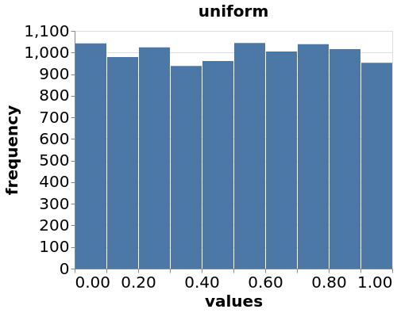
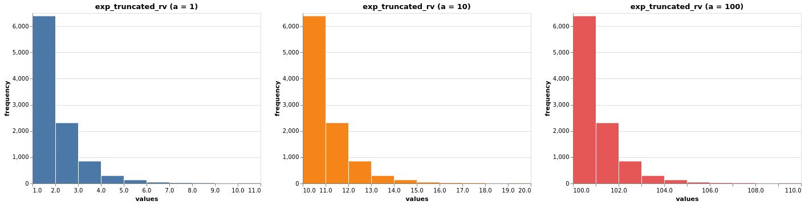
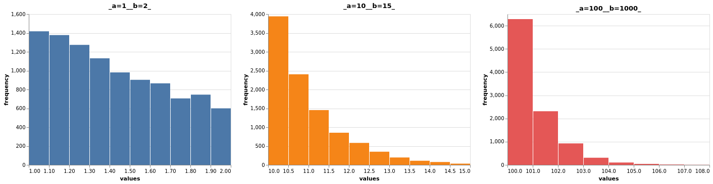

# Advanced Simulation
## Problem Sheet 1

### Exercise 1 (Inversion and rejection)

**1.** 
**Let $Y \sim Exp(\lambda)$ and let $a >0$. We consider the variable after restricting its support to be $[a, + \infty)$. That is, let $X = Y|Y \geq a$, i.e. $X$ has the law of $Y$ conditionally on being in $[a, +\infty)$. Calculate $F_{X}(x)$, the cumulative distribution function of $X$, and $F^{-1}_{X}(u)$, the quantile function of $X$. Describe an algorithm to simulate $X$ from $U \sim \mathcal{U}_{[0,1]}$.**

> Solution

The pdf and the cumulative distribution of an exponential r.v. $Y \sim Exp(\lambda)$ is given, respectively, by $f(x) = \lambda e^{-\lambda x}$ and $F_{Y}(x) = 1 - e^{-\lambda x}$. Then the cumulative distribution function of $X = Y|Y \geq a$, when $x \geq a$, is
$$
\begin{equation*}
	\begin{split}
		F_{X}(x) &= \mathbb{P}(X \leq x) = \mathbb{P}(Y \leq x|Y \geq a) =  \frac{\mathbb{P}(Y \leq x,Y \geq a)}{\mathbb{P}(Y \geq a)} \\
		&= \frac{\mathbb{P}(a \leq Y \leq x)}{\mathbb{P}(Y \geq a)} = \frac{\int_{a}^{x}\lambda e^{-\lambda s}ds}{\int_{a}^{\infty}\lambda e^{-\lambda s}ds} = \frac{e^{-\lambda a} - e^{-\lambda x}}{e^{-\lambda a}}\\
		&= 1 - e^{-\lambda (x - a)}
	\end{split} 
	\end{equation*}
$$
Since $a \leq x$, this cumulative probability function is well defined.
Now we calculate the quantile function:
$$
	\begin{align*}
		&F_{X}(x) = 1 - e^{-\lambda (x-a)} = 1 - e^{- \lambda x} e^{\lambda a} = u \implies \\
		&u - 1 = - e^{-\lambda x} e^{\lambda a} \implies  (1-u)e^{-\lambda a} = e^{=\lambda x} \implies \\
		&\ln{[(1-u)e^{-\lambda a}]} = \ln{(e^{-\lambda x})} \implies \ln{(1-u)} + \ln{e^{-\lambda a}} = - \lambda x \implies \\
		&x = F_{X}^{-1}(u) = a - \frac{1}{\lambda}\ln{(1 -u)}
	\end{align*}
$$

By the following theorem, we can simulate uniform r.v. and then use them in the formula above, for the exponential quantile, to generate exponential random variables.

>**Theorem (Universality of the Uniform)** 
Let $F$ be a CDF which is a continuous function and strictly increasing on the support of the distribution. This ensures that the inverse function $F^{-1}$ exists, as a funtion from $(0,1)$ to $\mathbb{R}$. We the have the following results.
>1. Let $U \sim U(0,1)$ and $X = F^{-1}(U)$. Then $X$ is an r.v. with CDF $F$.
>2. Let $X$ be an r.v. with CDF $F$. Then $F(X) \sim U(1,0)$.

Note that if $u \sim U(0,1)$, then $(1-u) \sim U(1,0)$. Therefore, we can simulate uniform r.v. and then use $F_{X}^{-1}(u) = a - \frac{1}{\lambda} \ln{(u)}$ to generate truncated exponential r.v. at $a$.

> Simulation

We first simulate $10.000$ uniform r.v.. We use the python's numpy library to simulate the uniforms. 

Next we use the formula above to generate exponential r.v. at $\lambda = 1$ at different values of $a$.

As we can see from the graphs, as well as the formula of the quantile, the restriction on $a > 0$ does not affect the distribution of the exponential r.v.

---

2.
**Let $a$ and $b$ be given, with $a < b$. Show that we can simulate $X = Y|a \leq Y \leq b$ from $U \sim \mathcal{U}_{[0,1]}$ using**
$$
\begin{equation*}
	X = F_{Y}^{-1}(F_{Y}(a)(1-U) + F_{Y}(b)U),
\end{equation*}
$$
**i.e. show that if $X$ is given by the formula above, then $\mathbb{P}(X \leq x)= \mathbb{P}(Y \leq x|a\leq Y \leq b)$. Apply the formula to simulate an exponential random variable conditioned to be greater than $a$, as in the previous question.**

> Solution

If $X$ has quantile function $X = F_{Y}^{-1}(F_{Y}(a)(1-U) + F_{Y}(b)U) \implies X = Y|a \leq Y \leq b$. 

Note that we are evaluating $F_{Y}^{-1}$ in a convex combination of points between $F_{Y}(a)$ and $F_{Y}(b)$, and since $F_{Y}$ is a valid cumulative distribution function, then $X$ must be a value between $a$ and $b$. With that in mind, we'll prove the statement above.
$$
\begin{align*}
	&x = F_{Y}^{-1}(F_{Y}(a)(1-u) + F_{Y}(b)u) \implies
	F_{Y}(x) = F_{Y}(a)(1-u) + F_{Y}(b)u \implies \\
	& F_{Y}(x) - F_{Y}(a) = F_{Y}(b)u - F_{Y}(a)u \implies \frac{F_{Y}(x) - F_{Y}(a)}{F_{Y}(b) - F_{Y}(a)} = u \implies \\
	&F_{X}(x) = \frac{F_{Y}(x) - F_{Y}(a)}{F_{Y}(b) - F_{Y}(a)} = \frac{\mathbb{P}(a \leq Y \leq x)}{\mathbb{P}(a \leq Y \leq b)} = \frac{\mathbb{P}(Y \leq x,a \leq Y \leq b)}{\mathbb{P}(a \leq Y \leq b)} \implies \\
	&F_{X}(x) = \mathbb{P}(Y \leq x|a \leq Y \leq b)) 
\end{align*}
$$

Now, before we simulate from the formula, we'll prove that when the r.v. is conditioned only to be greater than $a$, so that $b = + \infty$, then this simulation is equivalent to the one presented in the previous item. 

Since $F_{Y}(b) = \mathbb{P}(Y \leq b) = \mathbb{P}(Y \leq + \infty) = 1$, we get, using the conclusion above, that
$$
\begin{align*}
k	& F_{X}(x) = \frac{F_{Y}(x) - F_{Y}(a)}{1 - F_{Y}(a)} = \frac{e^{-\lambda a} - e^{-\lambda x}}{e^{-\lambda a}} = 1 - e^{-\lambda (x-a)}. \\
\end{align*}
$$

To simulate the r.v., we calculate the formula
$$
\begin{align*}
	&x = F_{Y}^{-1}[F_{Y}(a)(1-u) + F_{Y}(b)u]\\
	&x = F_{Y}^{-1}[(1-e^{-\lambda a})(1-u) + (1-e^{-\lambda b})u]\\
	&x = F_{Y}^{-1}[1 - e^{-\lambda a} + u(e^{-\lambda a}- e^{- \lambda b})]\\
	&x = - \frac{1}{\lambda} \ln{(e^{-\lambda a} - u(e^{-\lambda a}- e^{- \lambda b}))}
\end{align*}
$$
since $F_{Y}(y) = 1 - e^{-\lambda y}$ and $F_{Y}^{-1}(u) = 1 -\frac{1}{\lambda} \ln{(1 - u)}$. Using this formula we get the following simulation for $\lambda = 10$ and $a = 1, 10, 100$ and $b = 2, 15, 1000$.

